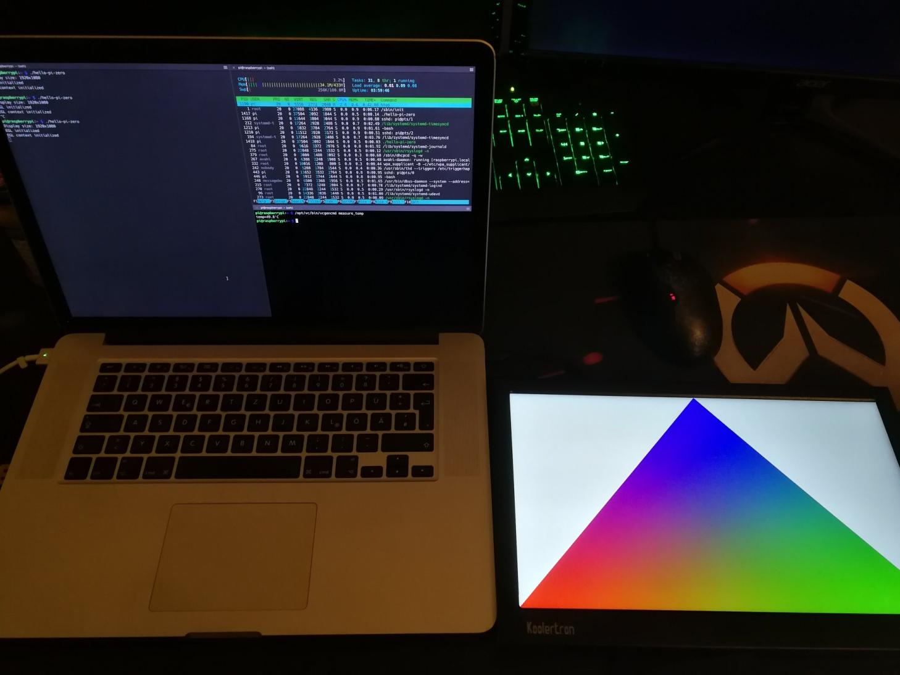

# Zero Monitor

Headless raspberry pi zero based kiosk monitor



## Setup

This code is built to run on `Raspbian Stretch Lite` (version `November 2018`), without a desktop, on a `Raspberry Pi Zero`.

## GLESv2 and EGL

The EGL and GLESv2 dylib files have been renamed on the pi, because of this i had to modify the EGL and GLESv2 libraries available via cargo. The original copyright and licence are at the top of the respective files, the original libraries can be found at:

* https://github.com/seankerr/rust-egl
* https://github.com/seankerr/rust-opengles

The original example this is based on can be found at 

* https://github.com/seankerr/rust-rpi-examples

## Development

For this setup SSH via USB has to be enabled on your pi.

This project is built with the help of a [docker container](https://github.com/dlecan/rust-crosscompiler-arm).

Before starting to develop you need to copy some files from the raspberry pi to link against:

```shell
mkdir -p ./sysroot/opt/vc
mkdir -p ./sysroot/usr
scp -r pi@raspberrypi.local:/opt/vc/lib ./sysroot/opt/vc/lib
scp -r pi@raspberrypi.local:/opt/vc/include ./sysroot/opt/vc/include
scp -r pi@raspberrypi.local:/usr/lib ./sysroot/usr/lib
scp -r pi@raspberrypi.local:/usr/include ./sysroot/usr/include
```

Then run the cargo toolchain in a docker container:

```shell
docker run -it --rm \
  -v $(pwd):/source \
  -v ~/.cargo/git:/root/.cargo/git \
  -v ~/.cargo/registry:/root/.cargo/registry \
  dlecan/rust-crosscompiler-arm:stable
```

Finally deploy the result onto your pi:

```shell
scp ./target/arm-unknown-linux-gnueabihf/release/zero-monitor pi@raspberrypi.local:/home/pi
```

## Licence

MIT
